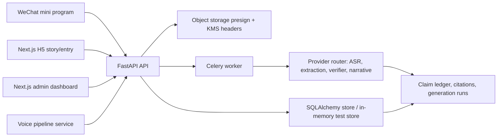

# Changjuan

[](https://github.com/legallchaperone/Changjuan/actions/workflows/ci.yml)

Changjuan is an evidence-grounded family story platform. It turns elder interviews,
family corrections, consent records, and private sharing into a traceable workflow:
every story claim should be backed by audio, photos, or family verification before
publication.

This repository is a full-stack Phase 1 implementation, not a UI-only prototype.
It includes API contracts, persistence, AI pipeline boundaries, admin operations,
WeChat mini program surfaces, H5 story entry pages, CI, migrations, and smoke-test
runbooks.

## Product Scope

- WeChat-first interview flow for families collecting elder stories.
- Consent-gated capture, second-consent review, private story links, and PDF export.
- Evidence ledger for claims, corrections, citations, and verifier gates.
- Admin dashboard for pilot metrics, project queues, support tickets, cost tracking,
  stuck project ownership, alert review, and backend task retry.
- Provider-routing layer for ASR, extraction, verification, and narrative generation,
  with failover hooks and generation-run metadata.
- Compliance paths for PII encryption, redaction, audit logs, data export, deletion,
  and T+7 purge execution.

## Architecture



See [docs/architecture.md](docs/architecture.md) for the component map and key
engineering decisions.

## Monorepo Layout

| Path | Purpose |
| --- | --- |
| `apps/api` | FastAPI app, auth, contracts, storage, observability, admin/user APIs |
| `apps/worker` | Celery tasks for transcription, extraction, verification, deletion, PDF |
| `apps/voice-pipeline` | Streaming interview capture policy and voice chunk guardrails |
| `apps/web-admin` | Next.js admin operations dashboard |
| `apps/web-h5` | Next.js H5 elder entry and private story surfaces |
| `miniprogram` | WeChat mini program pages and API client glue |
| `packages/changjuan_core` | AI, audio, compliance, provider, story domain logic |
| `packages/shared-types` | Shared TypeScript contracts |
| `packages/clients` | Typed API client used by frontend apps |
| `infra` | Docker Compose and Alembic migrations |
| `tests` | Unit, integration, and Phase 1 E2E contract coverage |
| `docs` | Architecture, product specs, reports, guides, ADRs, runbooks, evidence templates |

## Tech Stack

- Backend: Python 3.12, FastAPI, SQLAlchemy, Alembic, Celery, Redis, PostgreSQL,
  pgvector-compatible migration SQL, Pydantic v2.
- Frontend: Next.js 15, React 19, TypeScript 5, lucide-react.
- Mini program: WeChat TypeScript pages and WXML/WXSS surfaces.
- AI boundaries: provider router, prompt versions, generation-run metadata,
  raw input/output artifact hooks, verifier gates.
- Quality: pytest, pytest-asyncio, Ruff, npm workspaces, TypeScript typecheck,
  Next.js production builds, GitHub Actions.

## Quick Start

Prerequisites:

- Python 3.12
- Node.js 22
- Docker Desktop or a compatible Docker engine
- `uv`

```bash
cp .env.example .env
uv sync --extra dev
npm ci
docker compose -f infra/docker/docker-compose.yml up -d postgres redis minio
make migrate
make api
```

In another terminal:

```bash
make admin   # http://localhost:3000
make h5      # http://localhost:3001
```

For the combined local stack:

```bash
make dev
```

## Verification

```bash
make test
make lint
npm run typecheck
npm run build
```

CI runs Python tests, Ruff, lockfile validation, evidence-template validation,
TypeScript typechecks, both Next.js builds, and `npm audit --audit-level=moderate`.

The latest local completion audit is in
[docs/reports/phase1-completion-audit.md](docs/reports/phase1-completion-audit.md). It separates
what is proven in this worktree from production/pilot evidence that must come from
real provider, WeChat QA, legal, observability, and 100-household pilot artifacts.

## Demo Paths

- Admin dashboard: `http://localhost:3000`
- H5 landing/story preview: `http://localhost:3001`
- Elder interview entry: `http://localhost:3001/entry?project_id=proj_phase1_001`
- Fallback H5 interview entry:
  `http://localhost:3001/entry/fallback?project_id=proj_phase1_001`
- API health: `http://localhost:8000/healthz`

See [docs/guides/local-demo.md](docs/guides/local-demo.md) for a concise demo script.

## Resume Notes

This project is a strong resume item because it shows end-to-end product and
systems work: contracts, persistence, typed clients, admin operations, AI workflow
boundaries, evidence gating, compliance, and CI. A ready-to-use interview summary
is in [docs/guides/portfolio.md](docs/guides/portfolio.md).

## Security and Data Handling

- Do not commit `.env`, `api_key`, real provider credentials, private household
  data, or local audio corpora.
- `scripts/test_audio/` is intentionally ignored except for its corpus note.
- `.env.example` documents required configuration without secrets.
- Production readiness checks reject local/default secrets and unsafe runtime
  configuration.

## Status

Phase 1 implementation is materially complete as a codebase and local verification
target. Real-world completion still requires external evidence files for provider
smoke tests, WeChat device QA, legal signoff, pilot results, and production-class
observability/storage drills.
