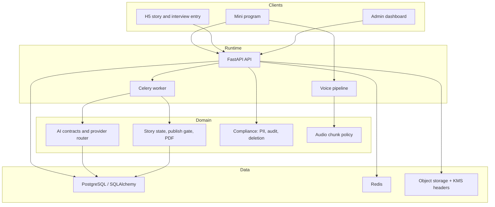

# Changjuan Architecture

## System Overview

Changjuan is organized as a monorepo with one API boundary, two web surfaces, one
WeChat mini program, one voice capture service, shared contracts, and a Python
domain package. The goal is to keep story publication evidence-grounded: claims,
citations, family corrections, consent, and deletion state are first-class runtime
objects instead of loose text.

## Component Responsibilities

| Component | Responsibility |
| --- | --- |
| `apps/api` | Auth, project lifecycle, consent, interview sessions, upload presigns, corrections, story/share/PDF, admin operations, health/readiness |
| `apps/worker` | Async transcription, extraction, verification, deletion purge, and PDF task orchestration |
| `apps/voice-pipeline` | Streaming guardrails for chunk duration, rate limits, silence handling, topic switching, and session-end intent |
| `apps/web-admin` | Operational dashboard for pilot metrics, support tickets, stuck projects, alerts, cost/manual exports, and retries |
| `apps/web-h5` | H5 interview entry, fallback entry, story preview, and audio citation interaction |
| `miniprogram` | WeChat login, project creation, photo upload, interview capture, correction, story/share/privacy flows |
| `packages/changjuan_core/ai` | Capture, extraction, verifier, narrative contracts and deterministic testable behavior |
| `packages/changjuan_core/compliance` | PII encryption, redaction, audit logs, deletion, export and purge policy |
| `packages/changjuan_core/story` | Publish gate, state machine, PDF rendering |
| `packages/shared-types` | Cross-surface TypeScript API contracts |
| `packages/clients` | Typed API client used by the web apps |

## Data and Evidence Model

The API stores runtime records for users, projects, consent records, deletion
requests, photos, interview sessions, audio chunks, transcripts, photo analyses,
claims, claim evidence, corrections, chapters, citations, story pages, share links,
comments, PDF exports, verification issues, generation runs, audit logs, alerts,
rate limits, support tickets, manual interventions, and AI costs.

Important invariants:

- A generated story can only move forward when verifier blocks are passed or
  resolved.
- Family-facing shares require publish-eligible state and second consent.
- Hidden or deleted claims do not leak into final story surfaces.
- Deletion hides a project immediately, minimizes consent evidence, and leaves a
  T+7 physical purge path.
- Provider calls should produce generation-run metadata with prompt version/hash,
  provider name, status, latency, and raw input/output artifact keys.

## Local vs Production Backends

The code supports an in-memory store for deterministic tests and SQLAlchemy for
runtime persistence. Production readiness validation rejects unsafe defaults such
as memory storage, localhost dependencies, default JWT secrets, missing WeChat
credentials, local object storage endpoints, and missing observability settings.

## Quality Strategy

- Unit tests cover domain contracts, settings, DDL, smoke harnesses, shared types,
  web/admin/miniprogram contracts, and SQLAlchemy persistence behavior.
- Integration tests cover API and voice-pipeline contracts.
- E2E tests encode named Phase 1 scenarios.
- CI validates tests, linting, lockfile state, evidence-template schemas, frontend
  typechecks, production builds, and npm audit.

## Known Non-Code Completion Gates

The repository includes validators and templates for external proof, but real
completion still depends on artifacts outside this worktree:

- live provider smoke proof
- WeChat device QA proof
- legal copy/signoff proof
- 100-household pilot metrics
- production observability, OSS/KMS, backup/restore, and purge drills

Those gates are documented in
[docs/phase1-completion-audit.md](phase1-completion-audit.md).
